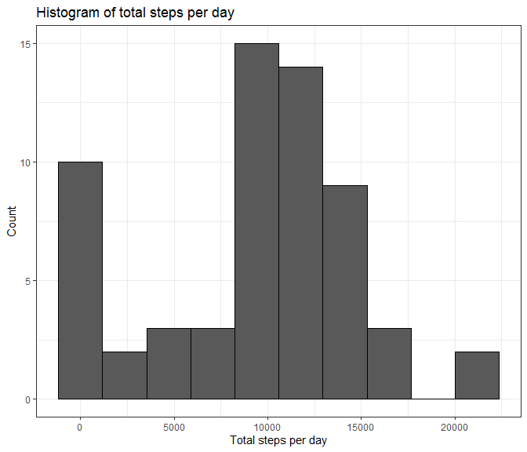
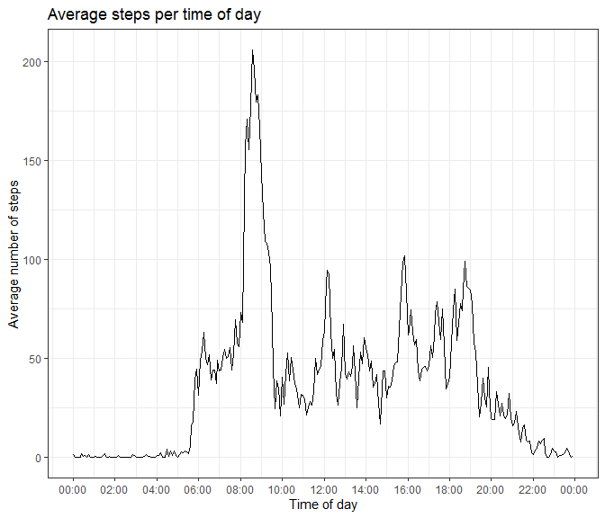
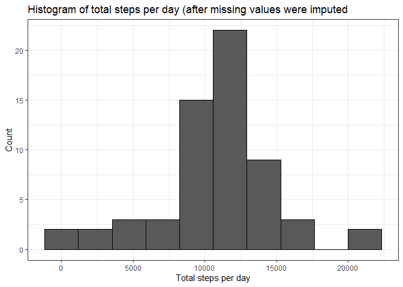
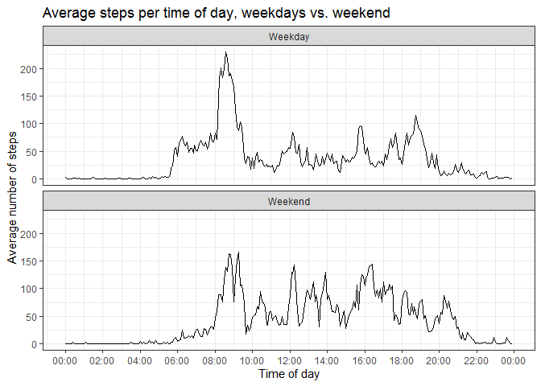

## Loading and preprocessing the data

In the first step, we will check, whether the CSV file is already in the folder. If it isn't, we will see if the zip file containing it is there (which it should be) and unzip it. In case the zip file is also missing for some reason, we will download it from the link that was provided in the instructions.


```r
if(!("activity.csv" %in% dir())) {
        if(!("activity.zip" %in% dir())) {
                fileUrl <- "https://d396qusza40orc.cloudfront.net/repdata%2Fdata%2Factivity.zip"
                download.file(fileUrl,destfile="activity.zip",method="libcurl")
        } 
        unzip("activity.zip")
} 
```

Next we read in the data using the `read.csv` function, specifying the string `"NA"` for the missing values. The strings containing the dates are read in as characters and not as factors.


```r
activity <- read.csv("activity.csv",na.strings = "NA",header=TRUE,stringsAsFactors=FALSE)
head(activity)
```

```
##   steps       date interval
## 1    NA 2012-10-01        0
## 2    NA 2012-10-01        5
## 3    NA 2012-10-01       10
## 4    NA 2012-10-01       15
## 5    NA 2012-10-01       20
## 6    NA 2012-10-01       25
```

Since we will be working with the date functions of R later on, we will transform the date column into the Date format.


```r
activity$date <- as.Date(activity$date)
str(activity)
```

```
## 'data.frame':	17568 obs. of  3 variables:
##  $ steps   : int  NA NA NA NA NA NA NA NA NA NA ...
##  $ date    : Date, format: "2012-10-01" "2012-10-01" ...
##  $ interval: int  0 5 10 15 20 25 30 35 40 45 ...
```

## What is mean total number of steps taken per day?
As the first step, we need to calculate the total number of steps for each given day. The `dplyr` package can be used to group the activity data based on the date, and summarise the total number of steps. For now, we ignore the `NA` values.


```r
library(dplyr)
abydate <- group_by(activity,date)
dailysteps <- summarise(abydate,total=sum(steps,na.rm = TRUE))
head(dailysteps)
```

```
## # A tibble: 6 x 2
##   date       total
##   <date>     <int>
## 1 2012-10-01     0
## 2 2012-10-02   126
## 3 2012-10-03 11352
## 4 2012-10-04 12116
## 5 2012-10-05 13294
## 6 2012-10-06 15420
```

The results can be shown in a histogram, using the `ggplot2` package:


```r
library(ggplot2)
g <- ggplot(dailysteps,aes(total))
g + geom_histogram(bins = 10,col="black") + 
        theme_bw() + ggtitle("Histogram of total steps per day") +
        labs(x="Total steps per day", y="Count") 
```

<!-- -->

The mean and median number of steps per day are easily calculated:


```r
meansteps <- mean(dailysteps$total)
mediansteps <- median(dailysteps$total)
paste("Mean number of steps: ",meansteps)
```

```
## [1] "Mean number of steps:  9354.22950819672"
```

```r
paste("Median number of steps: ",mediansteps)
```

```
## [1] "Median number of steps:  10395"
```


## What is the average daily activity pattern?
In the next step of the analysis, we will group the data not by the date, but by the 288 five minute time intervals into which each day has been separated.


```r
abytime <- group_by(activity,interval)
avgsteps <- summarise(abytime,avg=mean(steps,na.rm = TRUE))
head(avgsteps)
```

```
## # A tibble: 6 x 2
##   interval    avg
##      <int>  <dbl>
## 1        0 1.72  
## 2        5 0.340 
## 3       10 0.132 
## 4       15 0.151 
## 5       20 0.0755
## 6       25 2.09
```

The interval column consists of the numeric values 0, 5, 10, ..., 2350, 2355. To plot the data as a function of time, these interval numbers can be transformed into the `POSIXct` format. The `sprintf` function turns each numeric value into a string of length 4, i.e. 0 -> "0000".


```r
inttime <- as.POSIXct(format="%H%M",sprintf("%04d",avgsteps$interval))
```

Now we can make a nice time series plot of the average numbers of steps taken.


```r
g <- ggplot(avgsteps,aes(inttime, avg))
g + geom_line() +
        theme_bw() + ggtitle("Average steps per time of day") +
        scale_x_datetime(date_breaks = "2 hours",date_labels = "%H:%M") +
        labs(x="Time of day", y="Average number of steps") 
```

<!-- -->

We also want to know which five minute interval contains the maximum number of steps.


```r
maxavg <- which.max(avgsteps$avg)
avgsteps[maxavg,]
```

```
## # A tibble: 1 x 2
##   interval   avg
##      <int> <dbl>
## 1      835  206.
```

The maximum number of average steps, 206.17 is recorded in the five minute interval starting at 8:35


## Imputing missing values
As we could already see initially, a number of entries are missing. First, let's confirm that no rows have missing data in their interval or date columns.


```r
sum(is.na(activity$date))
```

```
## [1] 0
```

```r
sum(is.na(activity$interval))
```

```
## [1] 0
```

As expected, those columns do not have missing entries, only the steps column. We can calculate both the number and the fraction of missing values:


```r
sum(is.na(activity$steps))
```

```
## [1] 2304
```

```r
sum(is.na(activity$steps)) / length(activity$steps)
```

```
## [1] 0.1311475
```

Next, we want to fill these missing values in with actual numbers. A simple strategy for that is to replace each missing value with the mean value that was calculated for that particular time interval across the entire dataset. We start by creating a copy of the original data, and going through it with a for loop in order to replace all the missing values. The average step counts are rounded to the nearest full number:


```r
act2 <- activity
for (i in 1:length(act2$steps)){
        if (is.na(act2$steps[i])) {
                intv <- act2$interval[i]
                act2$steps[i] <- round(avgsteps$avg[avgsteps$interval==intv])
        }
}
```

Let's confirm that there are no more missing values in the new dataset:


```r
sum(is.na(act2$steps))
```

```
## [1] 0
```

Now we want to see how the histogram for the total number of steps per day has changed as a result. We use the same method as above (note that we no longer need the `na.rm=TRUE` flag).


```r
a2bydate <- group_by(act2,date)
ds2 <- summarise(a2bydate,total=sum(steps))

g <- ggplot(ds2,aes(total))
g + geom_histogram(bins = 10,col="black") + 
        theme_bw() + ggtitle("Histogram of total steps per day (after missing values were imputed") +
        labs(x="Total steps per day", y="Count") 
```

<!-- -->

In comparison with the first figure, there are fewer counts in the first bin, and more counts in the sixth bin. This can also be seen in the mean and median number of total steps:


```r
meansteps2 <- mean(ds2$total)
mediansteps2 <- median(ds2$total)
paste("Mean number of steps: ",meansteps2)
```

```
## [1] "Mean number of steps:  10765.6393442623"
```

```r
paste("Median number of steps: ",mediansteps2)
```

```
## [1] "Median number of steps:  10762"
```

Both values have increased, which is no surprise, since approximately 13% or the original data were missing, including whole days (hence the large count in the first bin of the original histogram). This brought the averages down.


## Are there differences in activity patterns between weekdays and weekends?
In this last part, we want to see whether there are differences in the average step counts for weekdays and weekends. To that end, we first create a new factor variable `day`, which indicates whether any given entry in the dataset was recorded on a weekday, or on the weekend. Since the string that is returned by `weekend()` function is determined by the system language, I force the use of an English locale here, and return to my original locale afterwards.


```r
oldlocale <- Sys.getlocale("LC_TIME")
Sys.setlocale("LC_TIME","English")

act2$day <- factor(weekdays(act2$date) %in% c("Saturday","Sunday"),
                   levels=c(FALSE,TRUE),labels=c("Weekday","Weekend"))

Sys.setlocale("LC_TIME",oldlocale)
```

Confirmation that the split was succesful:


```r
table(act2$day)
```

```
## 
## Weekday Weekend 
##   12960    4608
```

Now we want to group the data both by weekend/weekday and by the time interval, so that we can calculate average step numbers for each.


```r
day_avg <- act2 %>% group_by(interval,day) %>% summarise(avg=mean(steps))
head(day_avg)
```

```
## # A tibble: 6 x 3
## # Groups:   interval [3]
##   interval day       avg
##      <int> <fct>   <dbl>
## 1        0 Weekday 2.29 
## 2        0 Weekend 0.25 
## 3        5 Weekday 0.4  
## 4        5 Weekend 0    
## 5       10 Weekday 0.156
## 6       10 Weekend 0
```

As we can see, the output of this operation puts each time interval twice in a row, once for the weekday averages and once for the weekend averages. So we need to create a new time variable that corresponds to that.


```r
inttime2 <- rep(inttime,each=2)
```

Finally, we can create a panel plot that shows the differences between weekdays and weekends:


```r
g <- ggplot(day_avg,aes(inttime2,avg,fill=day))
g + geom_line() + facet_wrap(day~.,nrow=2) +
        theme_bw() + ggtitle("Average steps per time of day, weekdays vs. weekend") +
        scale_x_datetime(date_breaks = "2 hours",date_labels = "%H:%M") +
        labs(x="Time of day", y="Average number of steps") 
```

<!-- -->

While the interpretation of the results is not part of this project, there are some interesting things to observe. On weekends, the test subject seems to sleep longer on average and has more activity after 8pm. During the week there is a large spike around 8am, which could indicate a regular walking commute to work for example.

